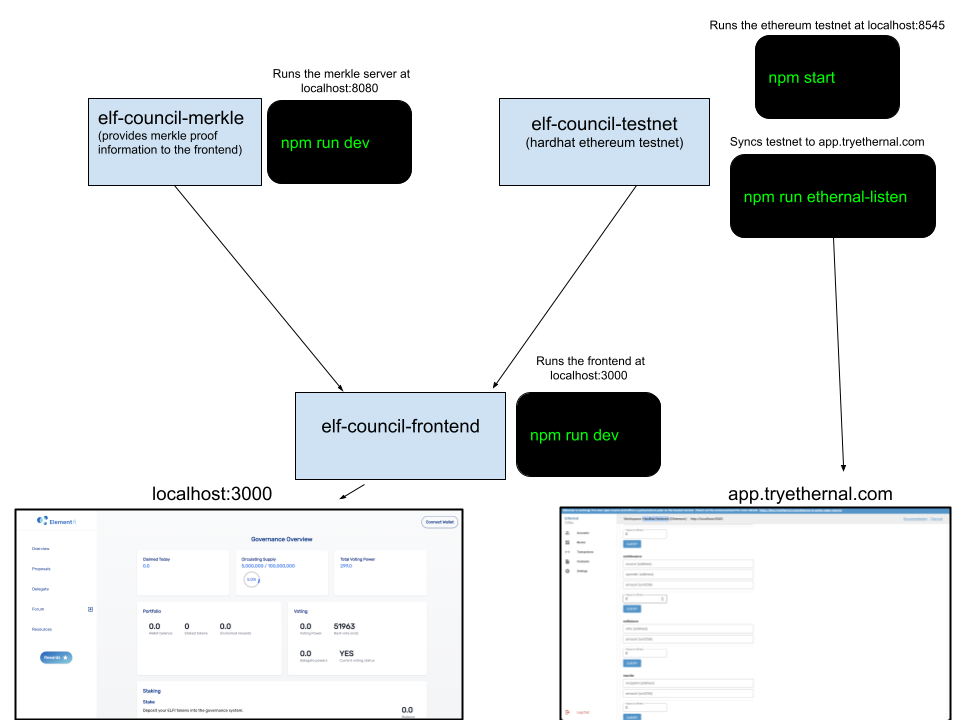

## Getting Started

First, some setup:

```bash
# install npm dependencies
npm ci
# copy the tokenlist and addresses jsons from the testnet
npm run copy-testnet
```

Then, run the development server (again from frontend/ directory):

```bash
npm run dev
```

Open [http://localhost:3000](http://localhost:3000) with your browser to see the result.

You'll also need to follow the README instructions for the elf-council-merkle and
elf-council-testnet repos. In total you'll need 4 terminal windows running processes. Here is a
diagram to help:


[API routes](https://nextjs.org/docs/api-routes/introduction) can be accessed on [http://localhost:3000/api/hello](http://localhost:3000/api/hello). This endpoint can be edited in `pages/api/hello.js`.

The `pages/api` directory is mapped to `/api/*`. Files in this directory are treated as [API routes](https://nextjs.org/docs/api-routes/introduction) instead of React pages.
